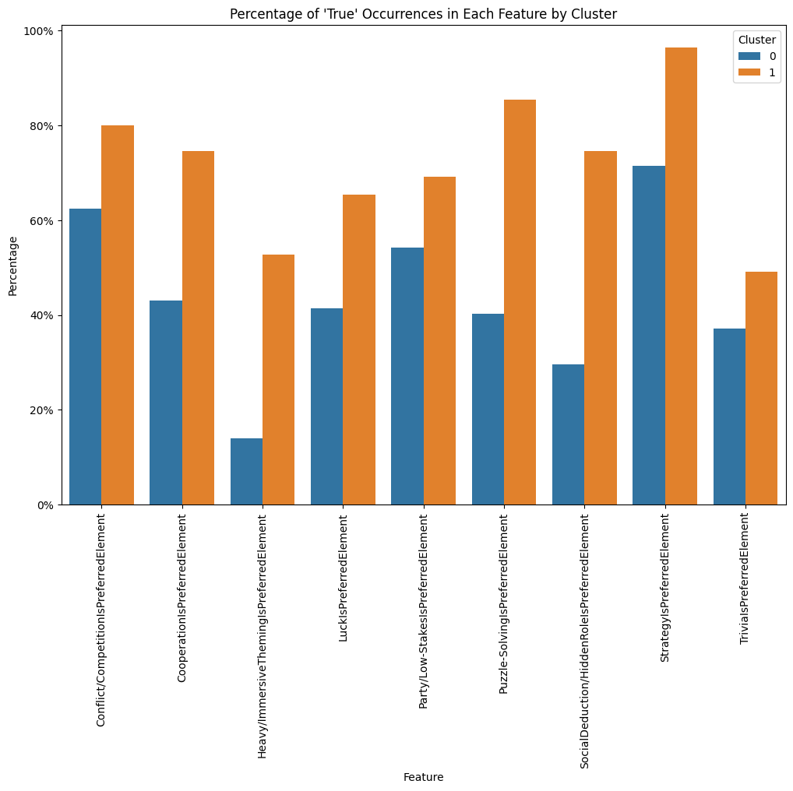
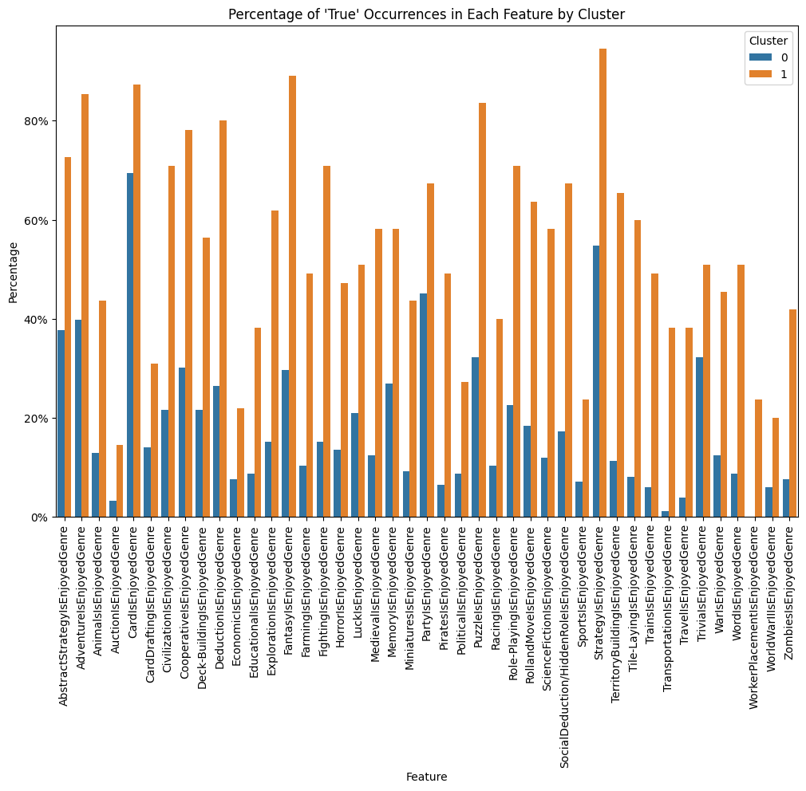

# **Milestone 2:** Board Game Behavior: An Analysis of Demographics and Gameplay Preferences

 
## **Authors**:
Dario Leyva-Brown, Marie Lawler, Seven Lewis

## Current Completion

[x] Survey Distribution
  - The survey has received 243 responses that can be used for analysis as of 12/3/23
  - The data cleaning pipeline was updated to properly bucket the new freeform text responses for Area of Study

[x] Exploratory Analysis
  - Progress from **Milestone 1**
    - The Milestone 1 roadmap outlines the exploratory analysis like so:
      > Team will finish exploring dataset for trends and meaningful correlations for use in the machine learning aspect of the project.

      This has been completed in full.
  - Description:
    - Functions:
      - Built several functions to efficiently and consistently analyze different parts of the data.
      - `categories_against_category` plots the percentage distribution of one feature against the an array of other features. This produces as many plots as their are features in the array. This is especially helpful for our use case as we have so many features to sift through. It allows us to view the normalized bar plots of each possible comparison and quickly see when distributions deviate between demographics.
      - `bools_against_category` is very similar to function above, but instead of looking at one categorical feature, it looks at several bool features to plot against another category. This also turns out to be very helpful because we had three multiselect questions (Race, PreferredElements, and EnjoyedGenres) and need to see if their are any relationships between checking a particular box and other features. 
      - `filter_threshold` allows for quick bucketing when doing exploratory analysis. Because the dataset isn't the largest, sometimes the number of catagories is too great to draw any meaningful data. When this is the case, `filter_threshold` will take a particular feature and bucket all specific catagories that have a count under some threshold value into an "Other" category.
    - Steps:
      - Count plot of each feature
        - This is simply to get an overview of each feature's distribution without any regard for subsets of the data.
        - This is important, because we can choose to disregard features with poor or uninteresting distribution. For example, Race will not yield any particularly interesting takeaways because the vast majority of people who took the survey were white. Thus, it would be unwise to conclude anything about the relationship between Race and Board Game statistics because we would be taking individual responses for minority race groups and assuming things for the whole group. 
      - Gender against features
        - I had to drop Non-binary responses because there were simply not enough responses to draw any meaningful relationships
        - This is by far the most interesting of the feature against feature analysis, here are a few particularly notable observations, of those who responded to my survey:
          - Religion
            - Women are more than twice as likely to declare their religiosity "Spiritual" than Men
            - Women are more likely to declare their religiosity "Christianity" than Men
            - Men were more likely to declare their religiosity "Agnosticism" or "Atheism" than Women
            - Men and Women were just as likely to declare themselves to have "No Specific Belief"
          - Area of Study
            - 47% of Men's declared Area of Study landed in "STEM" opposed to only 32% of Women. 
            - Because of this imbalance, Women's declared Area of Study was greater in "Education", "Health & Medicine", or "Other" than Men
          - Frequency of Play
            - These distributions were relatively the same
          - Style
            - Distributions were pretty close, however,
            - Women were slightly more likely to declare themselves a "Casual" player
            - Men were slightly more likely to declare themselves a "Strategic" player
          - Chess Rating
            - Women had slightly more than a 25% chance of giving Chess a rating of "1", this is opposed to Men's 8%
            - Inversely, Men had a 25% chance of giving Chess a rating of "7", this is opposed to Women's 11%
          - Preferred Elements
            - Women had nearly a 20% greater chance to select "Party/Low-Stakes" as a preferred element than Men
            - Women also had nearly a 20% greater chance to select "Trivia" as a preferred element than Men
            - The rest of the selections are relatively close across gender
          - Enjoyed Genre
            - Women had a more than 15% chance of selecting:
              - "Adventure", "Animals", "Luck", "Puzzle",  "RollandMove", and "Trivia" as enjoyed genres
            - Men had a more than 10% chance of selection:
              - "Deck-Building", "Fighting", "Political", "Role-Playing", "Science-Fiction", and "WorldWarII"
      - Chess Rating against single select features
        - Gender: As stated above for Gender vs Chess rating (instead of Chess Rating vs Gender), Men are significantly more likely to give chess a mid to high value rating than Women
        - Area of Study: STEM people were more generous towards Chess than those of "Other", "Arts & Humanities", and "Unknown"
          - Enjoys Board Games: If someone selected they did not enjoy board games (12 people in total), they basically always gave Chess a 3, 2, or 1. 
        - Board Games Owned: If someone selected that they didn't own any board games, than they would rarely give Chess a rating greater than 5
        - Frequency of Play: The less frequent you played board games, on average, the lower your rating of Chess
        - Style: "Strategic" players are much more favorable towards Chess than that of "Situation-Specific", "Casual", and "Party/Social". 
      - Board Games Owned against multi-select features
        - The more board games you own, the more likely you are to select many of the multi-select features, including but not limited to, "Strategy", "Cooperation", "Puzzle", "Abstract Strategy", "Adventure", "Cards", and "Fantasy"
      - Style against multi-select features
        - "Casual" players prefer games with Party/Low-Stakes significantly more than both "Situation-Specific" and "Strategic" players
        - "Situation-Specific" players prefer the genre's "Adventure", "Deduction", "Fantasy", and "Puzzle" over both "Situation-Specific" and "Strategic" players
        - "Strategic" players don't have many preferences that are much greater than either, but they do tend to dis-prefer "Cooperation", "Party/Low-Stakes", "Trivia", "Animals", and "Memory".  
      - AOS against multi-select features
        - Board Game Elements appear to be largely selected independently of Area of Study. However:
        - Luck is significantly more likely to be selected if you are not Area of Study is not "Arts & Humanities" or "Stem", or you selected "Undecided/Unknown."
        - You are slightly more likely to prefer "Party-Low/Stakes" if your Area of Study is "Arts & Humanities" or "Unknown" 
      - Clustering Machine Learning
        - I choose to also do a portion of the Machine Learning in the Exploratory Analysis to hopefully uncover specific patterns. 
        - The K-Means clustering algorithm was applied to the entire data set (excluding freeform text entry). 2 clusters yielded the greatest silhouette score of 0.1186 with the next nearest being 3 clusters at 0.0593. 
        - Graphing all features against the cluster assignments, we learn that the clustering algorithm has appeared to labeled the "Board Game Enthusiasts". The notable distribution observations are below: 
          - Most demographic features seem to be independent to this clustering.
          - Those of Cluster 1 have the BoardGamesOwned cluster have the bell curve shifted right, such that they are more likely to select the category "2 to 5", "5 to 10", "10 to 20", and "More than 20" 
          - Those of Cluster 1 also appear to generally play games more frequently, but this is less obvious than the previous note
          - Those of Cluster 1 are most likely to be "Situation-Specific" in terms of style.
          - Those of Cluster 1 are slightly more favorable to Chess
          - But most notably:
            - Those of Cluster 1 are significantly more likely to select any Board Game Element and Genre. 
            
            

[x] Machine Learning Predictive Task
  - Progress from **Milestone 1**
    - The Milestone 1 roadmap outlines the predictive task like so:
      > - Team will establish Machine Learning environment for model training, validation, testing.

      > - Team will explore different Machine Learning models like RandomForestRegression, K-NearestNeighbor, and Logistic Regression on decided features.

      This has also been completed in full. 
  - Description
    - First Attempt: Demographics Predict Board Game Stats
      - Because most demographic results did not yield the sufficient diversity of answers, I was only able to select "Gender", "Age", "Area of Study", and "Religiosity."
      - This unfortunately was insufficient for reliably predicting board game stats like "BoardGamesOwned", "FrequencyOfPlay", "ChessRating", and "Style". I was able to preform better than the baseline with all models I constructed, however, depending on the model, the $R^2$ score was still near 0, or the accuracy was significantly worse than 50%. 
      - I used both LogisticRegression and LinearRegression depending on if I first transformed the y with an Ordinal Encoder. This made sense for the ordered categorical variables "BoardGamesOwned", "FrequencyOfPlay", and "ChessRating". Otherwise I would use Logistic Regression 
    - Second Attempt: Board Game Stats Predict Gender
      - This pivot was necessary because of the poor performance of the previous models, however, it still 